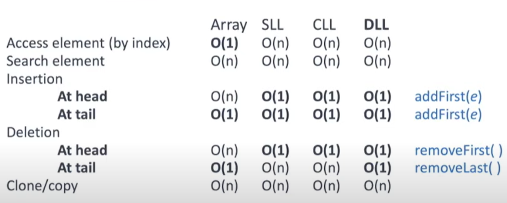

Arrays

- fixed-length
- sequence of same type elements
- access by interger indices
- in O(1) (constant) time
- In Java -> Reference Type
 
Example: Add element e to array at index i  
Shift scores[i] to scores [n-1]  
Set element at i to e  
Increment n
 
Time O(n)  
Space O(1) -> No need to declare any other spaces dependent on number of array entries
 
Example: Remove element e at index i of array  
Time O(n)  
Space O(1)
   

/////////
 
Insertion Sort

- processes entire array
- one index at a time
- left to right
- for each element in index, compare to previous element and insert element at right position
 
In-place algorithm = modifies array directly  
Implicit output = array passed by reference, no need for explicit return
 
Example:

In order from smallest to biggest
 
- Start at index 1 (skip 0).
- Copy A into temporary variable.
- Compare A to previous element (idx 0), D.
    
    - A is smaller, thus is not in right position
- D gets moved to the right, A is inserted at index 0
 
- Copy C into temporary variable.
- Compare C to previous element (idx 1), D.
    
    - C is smaller
- D gets moved to the right
- Compare C to previous element (idx 0), A.
    
    - C is bigger. So nothing needs to be moved
 
- etc...
 
Complexity:

- iterates over the entire array
- T(n) = c * ((n-1)n)/2
- So Time O(n^2)
- Space O(1), because we don't need to create other array to process result.
   

/////////
 
Testing for equality in arrays:  
Two arrays, scores1 and scores2  
Exact same values
 
|   |   |   |   |
|---|---|---|---|
|Test for equality|What is compared?|Result?|Time?|
|scores1 == scores2|array variable / reference|F|O(1)|
|scores1.equals(scores2)|array variable / reference|F|O(1)|
|java.util.Arrays.equals(scores1, scores2)|array's elements|T|O(n)|
   

/////////
 
Cloning arrays
 
1. GameEntry[] backup = new GameEntry[15];
2. backup = scores.clone();
3. scores[4].setScore(600);
 
1. Declares array backup for 15 GameEntry
2. Clone scores and assigns to backup
3. Sets score of scores[4] to 600.
 
.clone() changes the length  
e.g. from line 1 to 2, the length goes from 15 to 10
 
score of backup[4] turns to 600 after line 3. Why?  
.clone() creates a shallow copy
 
Shallow copy:  
elements are copied by reference  
so both original and backup array point to the same values
 
Deep copy:  
doesn't change when we alter original array

1. Implement interface Cloneable, override clone()
2. Create new array and copy elements one by one into new array by invoking clone() on each
   

////////
 
Expand array capacity

- Create deep copy into larger array
- With at most n additional positions is O(n) time and O(n) space
   

///////
 
Singly Linked List (SLL):

- consists of nodes
- each node points to the next node
- allows for efficient insertion/deletion
- Unlike arrays, not pre-defined size
    
    - Insertion:
    
    Change pointer of previous node to new node  
    Change pointer of new node to next node
    
    - Deletion:
    
    Preceding node’s pointer skips the deleted node
    
    - For both: O(1)
- Traversal requires going through list one by one, O(n)
    
    - only one direction
- Has head and tail. Tail's next reference is null
 
Doubly Linked List:

- Each node has two pointers, next and previous
- More flexible but uses more space
- Header and trailer nodes: dummy nodes that don’t hold actual data, but only point to a real node (or null)
    
    - avoids special cases
 
Circularly Linked List:

- Singly Linked List, but no explicit reference to head
- Explicit reference to tail (next is implicit reference to head
 
(Shallow) Cloning SLL: new nodes get created
   

////////
 
For SSL:
 
Insert at head

1. Create new node
2. Insert new node, point to old head
3. Update head, point to new node

Time = O(1)

- Creation, incrementing and updating can be done in constant time

Space = O(1)

- Only one new node created, with two references. Doesn't depend on size of list.
 
public void addFirst (E e) {  
head = new Node<>(e, head);  
if (size == 0) tail = head;  
size++;  
}
 
Insert at tail

1. Create new node
2. Update tail's next, point to new node
3. Update tail, point to new node
 
Remove head

1. Update head, point to current head's next. Garbage collector will reclaim old head node.
 
Remove tail

- Need to traverse list from head.
    
    - Can't detach tail node by setting reference to null. We need to reference node before tail, which can't be accessed from tail
- Find last but one node (node.next, node.next.next)
- Update tail, point to last but one node. Garbage collector will reclaim old tail node.

Time = O(n)
   

////////
 
For CLL:
 
Rotate

1. update the tail by following its next reference (implicit head)
 
Insert at head

1. Create new node with element & next reference pointing to tail's next
2. Update tail's next, point to new node
 
Insert at tail

1. Insert at the head (between tail and implicit head node)
2. Rotate
 
Remove head

1. Explicit pointer to head.
2. If identical to tail (there's only one node)
    
    - set tail to null
    - else, set tail's next to head's next
   

////////
 
For DLL
 
Create/Initialize

1. Create header note
    
    - element = null
    - prev = null
    - next = null
2. Create trailer node
    
    - element = null
    - prev = header
    - next = null
3. Point header's next to trailer
 
Insert

1. Create new node (predecessor/successor given by input)
    
    - element = e
    - prev = predecessor
    - next = successor
2. Set references to new node
    
    - pred's next
    - succ's prev
 
Remove

1. Get predecessor and successor nodes
2. Link out old node
 