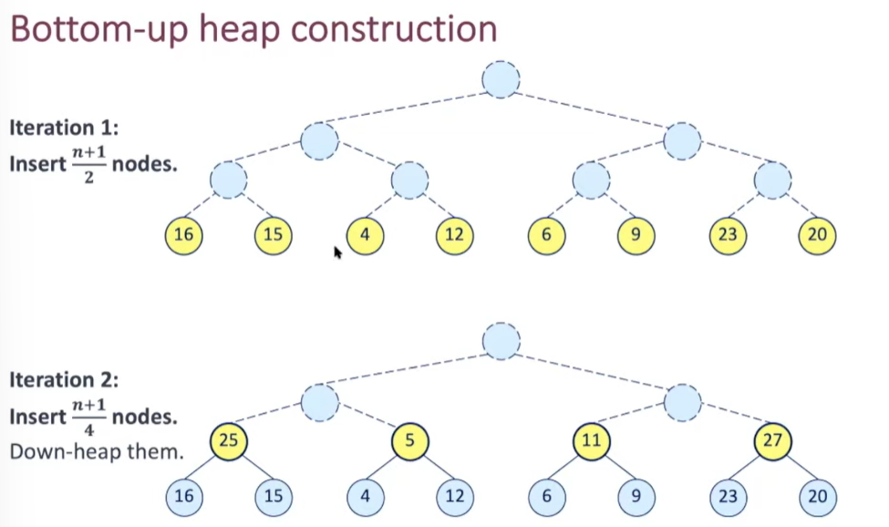

Previously: elements in sequence FIFO/LIFO
 
Prioritize certain elements ->

- key associated with an element establishes its priority
- comparable
 
For a comparison rule '<=' to be self-consistent, it must define a total order relation

- Comparability
- Anti-symmetry
- Transivity
- Reflexivity
 
If relation <= defines a total order over a finite set of keys, minimal key kmin is defined as: kmin <= k
 
Natural ordering: class defines it by implementing java.lang.Comparable

- primitive types
- example: string ordered lexicographically
 
External ordering: can be defined by implementing java.util.Comparator interface

- custom ordering
- example: can compare strings based on length
- a.compareTo(b) & compare(a, b) must return integer i as follows:
    
    - If a < b, i < 0
    - If a = b, i = 0
    - If a > b, i > 0
   

/////////
 
Priority Queue = collection of prioritized elements

- insertion at arbitrary positions
- removal of element with first priority

  
  

Implementations of Priority Queues:
 
|   |   |   |
|---|---|---|
||Unsorted List|Sorted List|
|Insertion|New entries added at the end of list      O(1)|Entries kept in non-decreasing order of keys      O(n)|
|Removal|Access and removal of minimal key done by traversing list      O(n)|Minimal key always first in list.      O(1)|
   

/////////
 
Binary Heap

- can be used as implementation for priority queue
- insertions/removals in logarithmic time
 
Binary Heap = Binary tree storing key-value pairs at its nodes

- Complete binary tree = all levels are completely full
    
    - except possibly the last level, in which case the remaining nodes occupy the leftmost positions
- Heap-order = for every node (except the root), its key is greater (or equal to) the key at its parent
    
    - entry with minimal key always at root of heap
- Height of heap with n entries: h = floor(log2 n)
- Number of nodes in levels 0 to h-1: 2h - 1
- Number of nodes in level h is at least 1, at most 2h
 
Heap: insert

1. Create new node with entry
2. COMPLETENESS
    
    - just beyond rightmost node at last level
    - at leftmost position of a new level
3. HEAP-ORDER
    
    - If p is root of tree, heap-order is satisfied
    - Otherwise, compare key at p to that of p's parent (q)
    - If kp >= kq, heap-order is satisfied
    - If kp < kq, restore heap-order by swapping
4. Time complexity of this (up-heap bubbling): O(log2 n)

Insert node at position p
 
Heap: removeMin

1. Replace root (smallest key) by last node
2. Restore heap-order if needed
4. Time complexity of down-heap bubbling: O(log2 n)
   

////////
 
(Binary) Heaps can be represented using arrays
 
Arrays aren't suited to all sorts of binary trees, but are suited to complete binary trees.  
That's because complete binary trees are neatly packed and has no empty spaces in-between
 
Generating indices: breadth-first / level-order  
Left child index = 2p + 1  
Right child index = 2p + 2  
Internal nodes leftmost  
Leaves rightmost
 
(Binary) Heaps can be represented using linked trees  
Very similar to binary tree
 
Methods insert & removeMin rely on

- locating last position
- local swapping between parent and child
 
Local swapping: O(1) per swap, O(log2 n) in total for both representations  
Accessing last position: O(1) in array, O(log2 n) in tree
 
For Linked-tree access to last position:

- extra reference to last node
- find last on demand
 
(access last position notes)
 
////////
    
/////////
 
Heap construction

- Keys not known in advance
    
    1. create empty heap
    2. call insert method for every new key -> O(n log2 n)
- Keys known beforehand
 
Keys known beforehand

- build heap using bottom-up approach
- at iteration i, pair of heaps with 2i - 1 keys are merged into heaps with 2i+1 - 1

  
  
  

For array: heapify
   

/////////
 
Adaptable Priority Queue  
Some scenarios require additional operations  
remove(e)  
replaceKey(e,k)  
replaceValue(e,v)
 
Quick access to locate entry e

- store index in entry itself
 