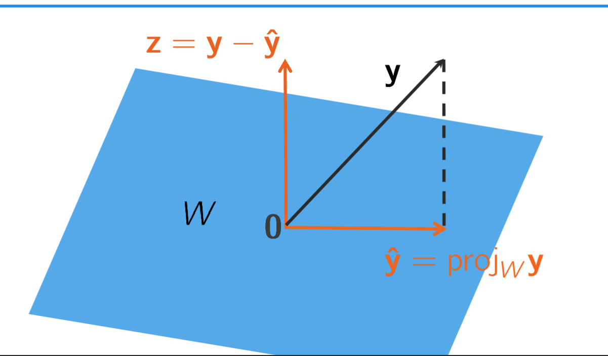

---
# Dot Product, Orthogonality
## Dot product

> Inner product of a and b
> 
> $\overrightarrow{a}\overrightarrow{b} = \overrightarrow{a}^T \overrightarrow{b} = |\overrightarrow{a}| |\overrightarrow{b}|cos(\theta)$
## Orthogonality

> orthogonal == 90 degree angle
> 
> 
> 
> $\overrightarrow{x}$ is orthogonal to W if it is orthogonal to every basis of W; w
## Orthogonal Complement

> Orthogonal complement $W^\perp$= everything that is orthogonal to your current subspace
> 
> 
> 
> The orthogonal complement $\overrightarrow{W}$ of W is the set of vectors representing every dimension that W is orthogonal to.
> 
> 
## Fundamental matrix spaces

> you need to know this fundamental property by heart
> 
> 
> 
> I don’t understand this yet, it was intuitive until the ^T, the orthogonal complement of a span of a matrix transformation is not just the null space, but the transpose thereof?
## Dimension, Orthogonal complement

> the sum of the dimension of a subspace W and it’s complement, is n(as in $R ^ n$, so all currently considered dimensions)

## Orthogonal vs Orthonormal

> orthogonal set = set that has orthogonal vectors
> 
> orthonormal set = orthogonal set with only lengths 1
> 
> 
> 
> ## Coordinates in terms of orthogonal matrices
> 
> something special happens when your bases are orthogonal, and something even more special happens when they are orthonormal.
> 
> 
> 
> ## Orthogonal columns
> 
> 
## Orthogonal Matrix extends Square Matrix

> orthogonal matrices have orthogonal rows and orthogonal columns  
> If a matrix is orthogonal  
>   
> 
> 
- $U^TU=I$
- $UU^T = P = I$
---
# Orthogonal Projections
## Orthogonal Projection onto a subspace

> $\overrightarrow{y} = \hat{y} + z$  
> for $\hat{y} \subseteq W$  
> and $z \subseteq W^\perp$
> 
> 
> 
> $\hat{y} = \hat{y}_1 + ... + \hat{y_2}$
> 
> ### Theorem
> 
> > _Let_ $W$ _be a **subspace** of_ $R^n$.  
> > _If_ $\{u_1,\space...,\space u_p\}$_is an_ **orthogonal** _basis for_ $W$  
> > _and_ $y \in R^n$  
> > _Then_  
> > $proj_w(\overrightarrow{y}) = \frac{\overrightarrow{y}\cdot u_1}{u_1 \cdot u_1} + ... +\frac{\overrightarrow{y}\cdot u_p}{u_p \cdot u_p}$
> 
> without the denominators in case of _**orthonormal**_ bases already
## Best-Approximation of something out of reach

> The best approximation of a point outside a subspace is it’s orthogonal projection onto the subspace (that _**is**_ accessible)  
> $\hat{y}$ is the optimal vector (shortest distance from $y$)
> 
> $\hat{y}$ is the best approximation of $y$ in the subspace W
> 
> > INTUITION: distance from point to line is defined as the shortest distance  
> > IN GENERAL:  
> > 
> > 
> 
> ### Theorem
> 
> > Let $W$ be a subspace of $\mathbb{R}^n$, $\overrightarrow{y}$ a vector in $\mathbb{R}^n$ and let $\hat{y}$ be the orthogonal projection of $\overrightarrow{y}$ onto $W$. Then $|y - \hat{y}| \leq |y - v|$ for all vectors $v$ in $W$.  
> >   
> > 
> > 
  
  
## Going from orthonormal bases of a subspace to its matrix

> “matrix” meaning the orthogonal transformation that maps to that subspace  
> $UU^T = P$  
>   
> 
> An orthogonal projection can be described as a Linear Transformation.
> 
> - evenly spaced, parallel lines are still evenly spaced and parallel after the transformation
> 
> ### Orthogonal Projections for video game shadows
> 
> A linear transformation can not represent perspective, but it can represent orthographically
> 
> 
> 
> ### Theorem
> 
> > Let $\{u_1,\space...,\space u_p\}$ be an ortho _**normal**_ basis for a subspace $W \subset R^n$  
> > Then  
> > 
> > - $proj_w(\overrightarrow{y}) =$ $UU^t (y)$, having $U = [u_1,\space ...,\space u_p]$
> > - $P = UU^T$, the standard matrix of the $projection_{ontoW}$, and $P=P^2=P^T$
  
# Distinctions

> An orthogonal matrix has _**orthonormal**_ columns  
> _**orthonormal**_ columns are orthogonal columns with unit length 1  
> $U^TU$ = I holds for orthogonal matrices  
> UUT= I holds for  
> orthogonal matrices  
> UUT = P holds for subspaces with _**orthonormal**_ bases  
> transform the given  
> orthogonal bases to _**orthonormal**_ by dividing by the length
  
## NEXT: Gram-Schmidt process

> The Gram-Schmidt process turns bases into orthogonal bases (useful so that you can use them for theorems that rely on that as a premise)