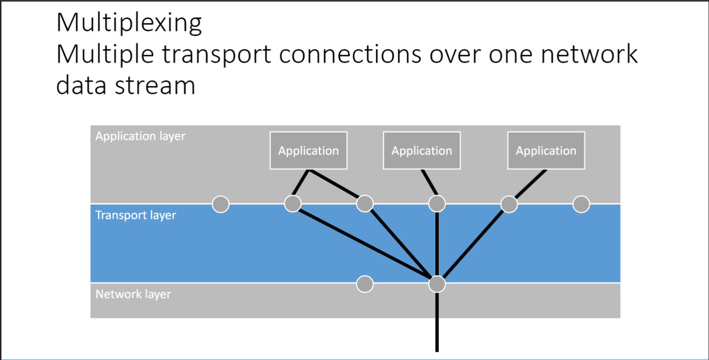

### Physical Layer OSI 1

> Bit ==as protocol data unit (PDU)==
- Electro-Magnetic Radiation
    
- Copper Wire
    
- Optical Cable
    
---
### Data Link Layer OSI 2

> Frame ==as protocol data unit (PDU)  
> The Data Link Layer  
> ==handles errors ==from the Physical Layer.==
- Error Detection
    - Parity Bit
        
        > a parity bit is appended to a message signifying such that the message has an even/odd amount of 1s and 0s.  
        >   
        > In case the receiver encounters a contradictory parity bit, retransmission is requested (in error detection)  
        
        
        
    - Parity Word
        
        > instead of immediately appending segments of the message with a parity bit, start with a longer message, and address segments of that message with sequential parity bits (the parity word)
        
    - Checksum
        
        > The sum of each block sums up to the checksum. The checksum is transmitted alongside the data, so that the receiver can verify the data block by ensuring that their (potentially flawed) data block also sums to the same  
        >   
        > (note that the checksum is 8 bits, so sum “373” would be 01110101, or “117” (since 373 % 256 = 117)  
        
    - Cyclic Redundancy Check (CRC)
        
        
        
- Error Correction
    - Parity Block
        
        > In addition to having 1 parity bit in each byte, have one entire byte dedicated to parity for every block as well. This allows for two-dimensional parity checking, which can offer error correction instead of detection (no need for retransmission if we know exactly where things went wrong)
        
    - Hamming Code
        
        > Hamming Codes allow for error _**correction**_ because they allow 1-bit errors to be corrected on the spot without need for retransmission. Burst errors can be detected, not corrected.
        > 
        > 
        > 
        > |   |   |
        > |---|---|
        > |parity bit **p** position|detects parity error in ==green positions==|
        > |0 (not used usually)|==0, 1, 2, 3, 4, 5, 6, 7, 8, 9, 10, 11, 12, 13, 14, 15==|
        > |1|==0,== ==1,== ==2,== ==3,== ==4,== ==5,== ==6,== ==7,== ==8,== ==9,== ==10,== ==11,== ==12,== ==13,== ==14,== ==15==|
        > |2|==0, 1,== ==2, 3,== ==4, 5,== ==6, 7,== ==8, 9,== ==10, 11,== ==12, 13,== ==14, 15==|
        > |4|==0, 1, 2, 3,== ==4, 5, 6, 7,== ==8, 9, 10, 11,== ==12, 13, 14, 15==|
        > |8|==0, 1, 2, 3, 4, 5, 6, 7,== ==8, 9, 10, 11, 12, 13, 14, 15==|
        > 
        > They have a much lower redundancy than, say, having multiple copies of all data.  
        > $2^k \geq m + k + 1$  
        > the hamming code of k bits should account for m + k error positions, and 1 no-error case.  
        
          
        
- Data Framing
    - Bit Stuffing
    - Byte Stuffing
        
        
        
        
        
        
        
        
        

> Flow Control ==(Error Control)==
- Utopian Simplex
    
    one-way data frame transmission
    
    only works in utopia (noiseless)
    
    
    
- Utopian Stop-And-Wait
    
    > Frame by frame  
    >   
    > no ACK-TIMEOUT means infinite waiting for lost data/lost ack  
    > only works in utopia (noiseless)  
    
    
    
- Stop-And-Wait ==ARQ/PAR==
    
    > Stop-And-Wait ARQ = Stop-And-Wait + ACK-NACK-TIMEOUT + SEQ  
    > - Send Frame  
    > - Receive Ack(Onto the next)  
    > - OR Receive Nak/Time out(retransmit with other different SEQ)  
    
    
    
- Go Back N ==Sliding Window ARQ==
    
    The sender has a window size N, the amount of frames that can be sent at a time.
    
    The window can only progress if the earliest frame is acknowledged.
    
    Since the receiver refuses to accept frame skipping (it discards intact skipping frames)
    
    The sender will retransmit the entire window that the lost frame was in.
    
    - Send 0
    - Send 1
    - Send 2
    - Send 3
    - Acknowledged 0
    - Send 4 ==(window progressed from 0-3 to 1-4)==
    - Acknowledged 1
    - Send 5 ==(window progressed from 1-4 to 2-5)==
    - Not Acknowledged 2
    - Send 2
    - Send 3
    - Send 4
    - Send 5
    - Ack 2
    - Send 6
    - Ack 3
    - Send 7
    - Ack 4
    - Send 8
    - Ack 6
    
    > [!important] not received? refuse to receive later ones and NAK → sender retransmits entire frame that started with lost frame
    > 
    >   
    >   
    > not acknowledged? refuse to progress window and retransmit the entire window of the lost frame  
    >   
    > can it happen that a lost frame is the second earliest frame (not the early end of the window)?  
    > no, because in that case, the first frame will either be ack’ed already (acked==window progression), or the fact that we know that the second is lost without having ack’ed the first will render the first lost.  
    >   
    > window needs to be consecutive/connected/intact.  
    
    
    
- Selective Repeat ==Sliding Window ARQ==
    
    Selective Repeat only retransmits the timed out/NACKed frames.  
    Receivers can perform frame skipping, sending NACK for skipped frames.  
    
    Window size is constant, but the window can be unconnected (n=4; 2 3 5 6 in window is allowed if 4 was acknowledged)
    
    
    

> ==The Data Link Layer handles== Medium Access Control
- Channel Allocation Protocol ==(CAP)==
    
    > Channel Allocation Protocol allows multiple parties to share the same medium. (Dynamic if the access is given more to the parties that need it more)
    
    
    
    - CSMA ==Carrier Sense Multiple Access==
        
        > [!important] This protocol listens to the carrier (medium) and tries to minimize the amount of collissions
        > 
        >   
        >   
        > CS: Only send data if the carrier is idle (not busy)  
        > p-persistence: Aggression level p of acting on idle medium.  
        > CSMA-CD: after sending, check carrier for collissions, try again if detected  
        > CSMA-CA: CTS→RTS handshake before sending data  
        
        
        
        - 1-Persistent CSMA
            
            > this persistence method is aggressive.  
            > any time (continously) that the medium is idle, we will try to transmit.  
            
            
            
        - Non-Persistent CSMA
            
            > This persistence method is not aggresive at all.  
            > Whenever the medium is sensed to be busy (in continuous time), we will wait a random backoff time before even sensing the medium again for an idle state.  
            
            
            
        - P-Persistent CSMA
            
            > this persistence method has a probability p of being aggressive.  
            > this persistence method works in discrete time, that is to say, all parties share and agree on a time slot division of the continous time.  
            >   
            > if the medium is idle, transmit packets with probability p  
            > in case of 1-p, wait for the next time slot.  
            > If it turns out that the medium is still idle, roll the dice again.  
            > if it turns out that the medium is now busy, wait for a backoff timer before even considering the state of the medium again  
            
            
            
        - CSMA-CD (CSMA Collision Detection)
            
            > Wait for free channel, transmit immediately, stop as soon as you detect the collision
            > 
            > 
            > 
            > no time slots
            
        - CSMA-CA (CSMA Collision Avoidance)
            
            > channel not free → random waiting backoff, channel free, (RTS, CTS if ieee variant), avoid collisions by doing a rtc-cts handshake before transmitting any data.
            > 
            > 
            > 
            > uses time slots
            
    - No Carrier Sense (ALOHA)
        - ALOHA
            
            > pure aloha (unslotted) allows al parties to send whenver they have something to transmit. In case of not receiving feedback in the expected time, resend the same package.
            
        - Slotted ALOHA
            
            > slotted aloha minimizes the effect of a collision.  
            > ==a collission will render all current packages to be garbled. that means that a package that is received in good hands for the most part, but garbled by a collission at the last moment, is considered entirely garbled. this means that a collision can affect packages from one package time before collision, to one package time after collision  
            >   
            > ====By dividing continous time into time slots and forcing that packages must be sent in their entirety whithin the time slot, the effect of a collission is at most the full duration of that time slot==
            
    - Multiple Access Collision Avoidance (MACA) IEEE802.11 RTS-CTS exchange
        
        > MACA solves the Hidden Terminal Problem and the Exposed Terminal Problem.
        
        - Why no carrier sense?
            
            > Wireless Communication doesn’t fit in carrier sense, nor no-carrier-sense, since the medium is only listened to when the wireless connection is strong enough (in range)
            
        - Hidden Terminal Problem (Hidden Node Problem)
            
            > Thinking that a collision won’t occur when it will.  
            > (Thinking the receiver is free, when it’s busy with another node)  
            >   
            > A and C are both in range of B, but A and C can’t do carrier-sense communication with B, because they don’t know whether B is busy with the other party  
            
            
            
        - Exposed Terminal Problem (Exposed Node Problem)
            
            > Thinking that a collision would occur when it wouldn’t  
            > Thinking that the recipient is in range, like the sender (you don’t want to garble the data!)  
            >   
            > Even though C can’t reach A and B can’t reach D, C still won’t transmit to D out of fear that it would garble B’s message to A (C is aware that B is transmitting something to someone)  
            
            
            
        - IEEE-802.11 (MACA) resolution
            
            > The MACA approach entails exchange of control frames (RTS>CTS)  
            > between sender and receiver.  
            > ==RTS control frame includes a length field (how long the medium is wanted) proportional to the frame size==  
            >   
            > Solves HTS:  
            > Nodes that see the CTS signal are close to the receiver of the transmission and will therefore wait for the transmission to be finished, so as not to interefere.  
            > ==HTS problem: garbling data, incoming for a neighbour, unaware of out-of-reach sender==  
            >   
            >   
            > Solves ETS:  
            > Nodes that see RTS without CTS understand that they are in range of the sender, but not the receiver, and will freely send messages, knowing that the receiver is not in range for this to cause any garbling.  
            > ==ETS problem: not daring to send data, out of fear that it would garble data, even though the recipient of said data is too far away for our transmission to affect it.==
            
- Ethernet==’s CAP==
    
    > Ethernet uses 1-Persistent CSMA/CD with binary-exponential backoff  
    > Minimal frame size: collision detection (padded if shorter than a frame)  
    > No sliding window protocol: collision detection leads to retransmission without need for acknowledgement. almost no bitflips, handled by higher layers  
    
- WiFi ==(IEEE.802.11)==
    
    > Stop-and-Wait Protocol:  
    > MACA: p-persistent CSMA/CA, RTS>CTS  
    > Binary-exponential Backoff  
    > Variable Address Count (Address not only of final destination, also forwarders)  
    > 
    > Infrastructore Mode: (requires wireless router)  
    > Ad-Hoc Mode: (doesn’t require wireless router)  
    

> LAN
- Hub
    
    > Hubs connect multiple nodes together, they can not filter the frames. They broadcast to all connected XXnodes XXX indiscriminately. (all the nodes will share the same medium)
    
- Switch
    
    > Switches forward frames from port to port.  
    >   
    > Backwards Learning Algorithm: Switches learn about the network they’re in by assuming we can reach a the sender of a message by the same port through which we received the message. (or flood all ports for unknown destination)  
    >   
    > Redundant Cabling: useful for failures  
    >   
    > Spanning Tree Protocol: prevents network overload from loops. Only allow sending through the spanning tree. Link failure leads to spanning tree adjustment.  
    
- Bridge
    
    Bridges can filter traffic. They can decide what frames to drop and which to actually forward. They only have two ports.
    
---
### Network Layer OSI 3

> Packet ==as protocol data unit (PDU)==
- IP Protocol
    - Dynamic Host Configuration Protocol (DHCP) IP Assignment
        
        > 4 step protocol
        
        
        
    - IPv4 IP packet structure
        
        
        
        - Source Address
            
            Sender’s IPv4
            
        - Destination Address
            
            Recipient’s IPv4
            
        - Header Checksum
            
            Checksum over the entire header, except the checksum itself
            
        - Time to live
            
            Every router forward of this packet will decrement the time to live by 1.
            
    - IPv6 IP packet structure
        
        
        
        - Source Address
            
            Sender’s IPv4
            
        - Destination Address
            
            Recipient’s IPv4
            
        - Hoplimit
            
            Every router forward of this packet will decrement the time to live by 1.
            
    - IPv4 CIDR Hierarchy Notation.
        
        
        
        
        
        > Classless InterDomain Routing allows us to divide networks  
        >   
        > Let’s break down 192.168.1.128/26  
        > ==192.168.1.128 - 1 Subnet Address==  
        > ==192.168.1.129 until 192.168.1.190 - 62 Addresses==  
        > ==192.168.1.191 - 1 Broadcast Address==  
        > ==32-26=6, 2^6 = 64 addresses  
        > 128 + 63 = 191  
        > Note that the first address represents the entire subnetwork, and the last address represents the broadcast  
        > the 128 gives the starting point, which is also the subnet address  
        > ==
        
- Routing Protocol
    
    
    
    
    
    - Distance Vector Routing
        
        
        
        > Every node holds a DCH routing table (destination, cost, hop)  
        > the initial routing table for any node only holds the values for direct neighbours  
        > when an inbound message arrives, it updates our routing table with the information that we can derive from the routing of the inbound message  
        >   
        > A message that came from two exchanges away tells us something about the nodes that are three nodes away.  
        
    - OSPF Link-State Intra-Domain Routing
        
        > Each router has an LSA (Link State Advertisement), which contains information about the links to adjacent routers and the metrics (costs) associated with those links.
        > 
        > Each router also has an LSD (Link State Database), which contains the LSAs from all routers in the same routing area.
        > 
        > Two routers that are fully adjacent neighbors will share their LSDs with each other.  
        >   
        > Packets are routed, according to dijkstras shortest path algorithm. The routers use their lsd with full network area topology for this.  
        
    - BGP Path-Vector Inter-Domain Routing
        
        
        
        > Distance Vector Routing and Link State Routing can only follow a LEAST COST policy. Path Vector Routing allows for different policies.  
        >   
        > Path Vector Routing entails each node holding an map with destination keys and vector values (the vectors consist of the ordered hops necessary)  
        >   
        > When an inbound message arrives, we can update our own path vectors by considering the best between our own mapping, and the new proposed mapping (prepended with the necessary steps to take us to the root of that map)  
        
    - Traffic Aware Routing
        
        
        
    - Multicast 224.0.0.1
        
- Fragmentation
    
    > ==The Internet is made up of nested networks.  
    > Each network has its own max packet size  
    > You should fragment packets for compatibility  
    > ==
    
    - Transparent Fragmentation
        
        > A packet can exceed the networks MTU (maximum transmission unit)  
        > It will be fragmented by the network layer devices: routers/switches/gateways  
        > It will be reassembled by the receiver  
        > Transparent: end users are unaware of the abstracted fragmentation process.  
        
    - Non-Transparent Fragmentation ==IPv4==
        
        > A packet can exceed the networks MTU (maximum transmission unit)  
        > The sender can set the DF; Don’t Fragment flag, which means the network should drop instead of fragment.  
        > If this does end up being dropped, an ICMP (internet control message protocol) message will be sent to the sender.  
        > Each packet is seperately routed; they may happen to take different paths.  
        > Non-Transparent: end users are aware of the fragmentation process, getting ICMP feedback, being able to set flags. (  
        
    - MTU-Discovery ==IPv6==
        
        > The sender discovers the bottlenecking MTU by sending DF packets, and anticipating ICMP “Destination Unreachable; fragmentation needed and DF set” for limiting MTU values. Then the sender will use this information to fragment into the least amount of fragments, still respecting the lowest MTU size.
        
- Other Protocols
    - Internet Control Message Protocol (ICMP)
        
        > Routers provide info to hosts (failures, …)
        
    - Address Resolution Protocol MAC ARP(IP)
        
        > acts on _**Data Link Layer**_  
        >   
        > Assigns **MAC**-address to **IP** address
        
        
        
    - Network Address Translation inIP NAT(exIP)
        
        
        
- Congestion Control Protocol
    - Random Early Detection (RED)
        
        > routers are dropping random packets to relieve congestion  
        > 3 duplicate/missing ack’s → congestion signal (to higher transport layers)  
        
    - Explicit Congestion Notification (ECN) (feat. transport layer)
        
        > sender requests ECN by setting an IP header bit to 1  
        > if congested, routers will set the IP header congestion bit to 1.  
        > the recipient notices and will send this signal back to the receiver (boomerang kinda)  
        
    - ICMP Flood attacks Router
        
        
        
    - Congestion Control
        
        
        
- Network Provisioning
- Admission Control Protocol
    
    
    
---
### Transport Layer OSI 4

> Segment ==as protocol data unit (PDU)  
> Works  
> ==Exclusively on end users==, not the medium==
- Berkeley → POSIX Socket
    
    > We can use one network connection for multiple applications by muxing the datastreams of multiple sockets over the network and demuxing incoming datastreams to different datastreams for different ports.  
    >   
    > Socket address = IP address + port address  
    > POSIX Sockets are a standardized version of Berkeley Sockets  
    
    - socket address primitive instructions
        
        1. SOCKET() - create the socket
        2. BIND() - bind to socket address
        3. LISTEN() - start accepting connections
        4. ACCEPT() - establish connection
        5. READ()
        6. WRITE()
        
        
        
        
        
        
        
        
        
        
        
- UDP
    - UDP Segment Header Structure
        
        
        
        
        
    - Error Detection
        - SEQ Number
            
            > Initial SEQ+ \#sent bytes
            
            Missing, Out of Order, Duplicate Segments are handled.
            
        - Ack Number
            
            > Initial SEQ+ \#received bytes
            
- TCP
    
    - TCP segment header
        
        
        
    - Error detection
        
        > SYN ACK FIN are messages with no body  
        >   
        > If SEQ/ACK does not match local state ⇒ retransmit  
        
        - SYN
            
            > choose a random SEQ before sending/after receiving SYN
            > 
            > adds 1 to SEQ and ACK
            
        - SEQ
            
            > SEQ + \#bytes sent
            
        - ACK
            
            > ACK does not increase SEQ
            > 
            > SEQ(sender) + \#bytes received
            
        - FIN
            
            > adds 1 to SEQ and ACK
            
    - Connection establishment and termination
        
        
        
        
        
        > A chooses SEQ x, ACK , sends that, now SEQ x+1, ACK  
        > B chooses SEQ y, ACK x+1, sends that, now SEQ y+1, ACK x+1  
        > A is now SEQ x + 1, ACK y+1, sends that, now SEQ x + 2, ACK y + 1  
        
        - Direct Acknowledgement
            
            > Seperate packet dedicated to ack is sent
            
        - Piggybacked Acknowledgement
            
            > ack piggybacks the next packet
            
        - Asymmetric Disconnect
            
            > Client and server close independently.
            
        - Symmetric Disconnect
            
            > Client and server agree close connection simultaneously  
            > FIN FIN ACK  
            
            
            
              
            
    - Error control
    - Flow control
    
      
    
      
    
    - Congestion control
        - Negotiate ECN
            
            
            
            Sender: SYN has ECE and CWR to 1  
            Receiver: SYN has ECE and CWR to 0 (or ECE 1 CWR 1 if decline)  
            
        - Congestion w/ ECN
            
            > Receiver sets ECE flag (I’m overloaded)  
            > Sender sets CWR flag (I’ve received your signal and reduced the congestion window)  
            
        - Tahoe Congestion Policy
            
            
            
        - Threshold becomes failing windows / multiplicative factor
            
            
            
        - Reno Congestion Policy
            
            > Instead of doing a slow start recovery, start at the new, lower, threshold
            
            
            
        - Compound TCP
            
            > TCP Reno with delay to account for queueing delay (router)  
            >   
            > Windows uses compound TCP  
            
        - Cubic TCP
            
            > any signal of congestion reduces the window size to 70%
            
    - Drawbacks to TCP
        - Silly-Window Syndrome
        - A lot of overhead (handshake)
        - Head of Line blocking (need for orderedness is overconservative, sometimes new data shouldn’t wait for old data)
    - Dodging the Forbidden Region
        
        > When a transmission takes too long, new gen sequence numbers can start overlapping with the ones you’re using. If it takes at most T seconds for a sequence number to find a destination, a collission can occur when a new gen sequence number with the same number is generated. That’s why there is a forbidden region of T seconds before the new gen number, that the old one can no longer be used anymore.
        > 
        > 
        > 
        > 
        
- UDP → QUIC Protocol
    
    > **Quick UDP Internet Connections**  
    >   
    >   
    > UDP + error control + flow/congestion control  
    > QUIC has connections and streams  
    > A connection can have multiple streams, identified by a stream identifier  
    > In-order delivery is guaranteed per stream=> Solves head-of-line blocking  
    >   
    > Only one three-way handshake (instead of TCP and then TLS)  
    > Optional 0 Round Trip Time connection resumption:  
    > No handshake needed when previous connection existed (switch wifi to cellular)  
    > Congestion control: default CUBIC, others possible  
    > Flow control: same window principle as TCP but both on a connectionand stream level  
    
---
### Application Layer OSI 7
- Domain Name System
    
    > DNS translates human readable domain names to ip addresses
    
    - Hierarchy of DNS Name Space, DNS lookups
        
        
        
        - Iterative DNS lookup
            
            > The local machine will independently find the ip address by querying the dns servers that the previous dns server said to query.
            
            
            
        - Recursive DNS lookup
            
            > A single dns server will perform iterative dns lookup, so that the local machine can get an anwer in one go.
            
            
            
        
        > In response to the request, the name server responds with a domain resource record:
        > 
        > - A ==(an IPv4 address)==
        > - AAAA ==(an IPv6 address)==
        > - MX ==(domain that accepts email)==
        > - NS ==(a name server for this domain)==
        
    - Layer 4 Protocol to use
        
        > On what does DNS run?
        
        - UDP (not private but fast)
        - TCP (slow but reliable)
        - TLS (slow but secure)
        - HTTP (slow but secure)
- Traditional Application
    - Email
        - Message Format
            
            > Envelope finds recipient: Sender, Recipient, Encryption  
            > Header: Email metadata  
            > Body: Email payload  
            
        - Protocol to interact with mailbox
            
            
            
            > POP3 email receiving (downloaded to local)  
            > IMAP email receiving (persist on cloud, allows multi device sync)  
            > LOGIN, FETCH, CREATE, DELETE, EXPUNGE  
            > SMTP email sending  
            
            
            
            
            
- Modern Application
    - Universal Resource Locator
        
        > Protocol, Domain Name, Path
        
        
        
- Chord DHT Routing
    
    > Successor location = closest node at or higher than start location  
    > start = own location + $2^i$
    > 
    > 
    
---
### Security
- Confidentiality
    
    > **confidentiality is limiting data access, integrity is ensuring your data is accurate, and availability is making sure it is accessible to those who need it**
    
    - Disclosure of Vulnerability
        
        > Full - immediate disclosure (vulnerability window)  
        > Responsible - deadline  
        > Coordinated - deadline w/ regards to realistic fix time  
        
    - Symmetric Encryption
        
        > Two parties share a common secret key
        > 
        > - Stream Cipher
        >     
        >     > bit-by-bit encryption
        >     
        > - Block Cipher
        >     
        >     > block-by-block encryption
        >     > 
        >     > - Electronic Codebook
        >     > - Cipherblock Chaining
        >     > - Counter Mode
        >     
        
    - Asymmetric Encryption
        
        > Public key encryption & private key decryption
        > 
        > - RSA
        >     
        >     primes p, q
        >     
        >     n=pq
        >     
        >     $C=M^e (mod\space n)$
        >     
        >       
        >     
        >     Find d such that de = 1 (mod (p-1)(q-1) ):
        >     
        >     $M=C^d(mod\space n)$
        >     
        
    - Diffie-Hellman Key Exchange
- Integrity
    - MAC exchange
        
        > Symmetric cryptography, repudiation
        
    - Digital signature
        
        > Asymmetric cryptography, nonrepudiation  
        > Usually done on top of hash.  
        
- Availability
  
- Firewall
    
    > A firewall monitors and filters traffic
    > 
    > - Threat Detection
    >     
    >     > Whitelisted vs Blacklisted  
    >     > Signature-based vs Anomaly-based detection  
    >     
    >       
    >     
    > - Packet Filter Firewall
    > - Stateful Firewall
    > - Firewalls with Deep Packet inspection
    > - Personal Firewall
    
- VPN
    - IPSEC VPN Tunnel Mode
        
        > Encrypt original IP packet entirely.  
        > An IP packet addressed to the VPN has an encrypted payload, being an IP packet that is addressed to the end destination (100% always identical to the packet you would send without a vpn)  
        
    - IPSEC VPN Transport Mode
        
        > Encrypt IP payload only.  
        > An IP packet addressed to the VPN has as payload, an IP packet with unencrypted header and encrypted payload.  
        
- Tor
- TLS
- HTTPS = HTTP + TLS (SSL)
- DNSSEC counters spoofing, cache poisoning
    
    > Servers in a dnssec zone will only accept dns records from their parent in the chain of trust, verifying that the sender is really the parent, not an attacker, using signatures.  
    > DNS servers come preinstalled with the public key of the root anchor of the trust chain, which can cascade down via the parent to the server.  
    > 
    > - DNS Spoofing
    >     
    >     > Pretending to be a DNS server, controlling the ips a victim end user receives as a response to a domain name. Affects a single, or small targeted portion of end users.
    >     
    > - DNS cache poisoning
    >     
    >     > Giving a DNS server’s memory false ip addresses to map to domain names. Affects the entire user base of the DNS server.
    >     
    
- PGP Email Encryption
    
    > Hybrid-encryption for confidentiality  
    > Hash-then-Sign for Integrity  
    > Web-of-Trust PKI  
    
- OTR Messaging
  
- Hierachical PKI
- Web of Trust
- MAC/MIC Message auth code
    
    
    
- Nonce
    
    > meaningless but useful random number
    
- Caesar Cipher
- Monoalphabetic Substituion Cipher
- One Time Pad
- Cryptology = Cryptography + Cryptanalysis
    - Symmetric Encryption
        
        > Parties share a secret key.
        
        - Two types: stream (bit-by-bit) and block ciphers (block-by-block).
        - Block ciphers use P-boxes and S-boxes.
        - Modes of operation: Electronic Codebook, Cipherblock Chaining, Counter Mode.
        - Nonces/initial vectors prevent patterns.
    - Asymmetric Encryption
        
        > Uses two keys: public (encryption) and secret (decryption).
        
        - Example: RSA (insecure without randomization).
        - Hybrid encryption combines symmetric and asymmetric.
    - Integrity
        - Message authentication codes (MACs) (symmetric) ensure integrity.
        - Digital signatures (asymmetric) provide nonrepudiation.
    - Public-Key Infrastructures (PKIs)
        - Manage public keys securely.
        - Hierarchical PKIs vs. Web-of-Trust.
    - Kerckhoff’s principle: All algorithms must be public; only the keys are secret
- Wireless Security
    - Goals: confidentiality, integrity, access control.
    - WEP flaws led to WPA (WPA2, WPA3) improvements.
- Firewalls
    - Protect networks by classifying traffic.
    - Types: packet filter, stateful, deep packet inspection, personal.
- Virtual Private Networks (VPNs)
    - Provide secure communication over untrusted networks.
    - Modes: transport (within network), tunnel (between networks).
    - Example: IPSec.
- Tor
    - Provides anonymity via onion routing.
    - Uses Diffie-Hellman for shared keys.
  
  
---
### buzz words
- connection
    
    the medium for communication between end users.
    
- connection-oriented communication
    
    > communication, with prior establishment of connection (and what protocol to use)
    
- connectionless communication
    
    > communication without prior establishment of connection
    
- transmission delay
    
    > The time it takes for the entirety of the packet to make it onto the medium
    
- latency = transmission delay + propagation delay
    
    > The time to put the entire packet on the medium, and the time to propagate all data to the end  
    > (transmission delay starts with the first part of the packet, and ends with the last)  
    > (propagation delay starts with the first part of the packet, and ends with the last)  
    
- round trip time = latency forth + processing time at B + latency back
    
    > RTT consists of the latency to the end user plus the time it takes for them to respond plus the time it takes for the response to make it back to you
    
- bandwidth of medium
    
    > the theoretical amount of data that can be transferred in parallel, per time unit
    
- throughput of medium
    
    > the real amount of data that can be transferred in parallel, per time unit (after bandwidth congestion)
    
- goodput of medium
    
    > the amount of useful (payload) data that can be transferred, per time unit
    
---

