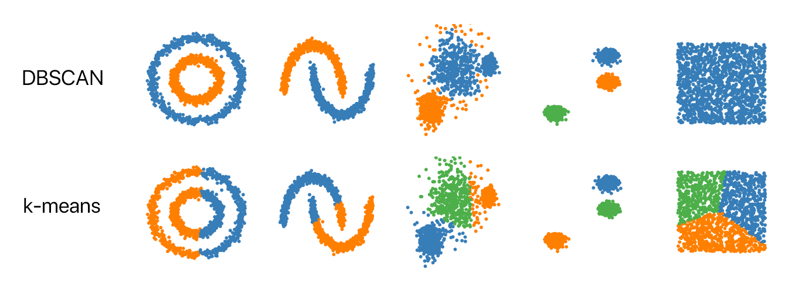
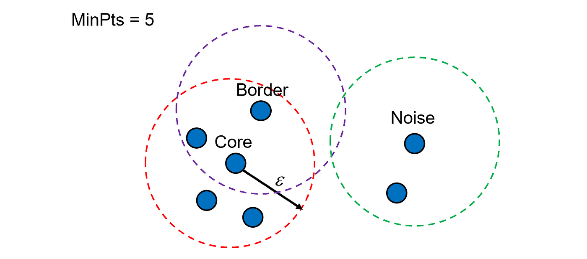
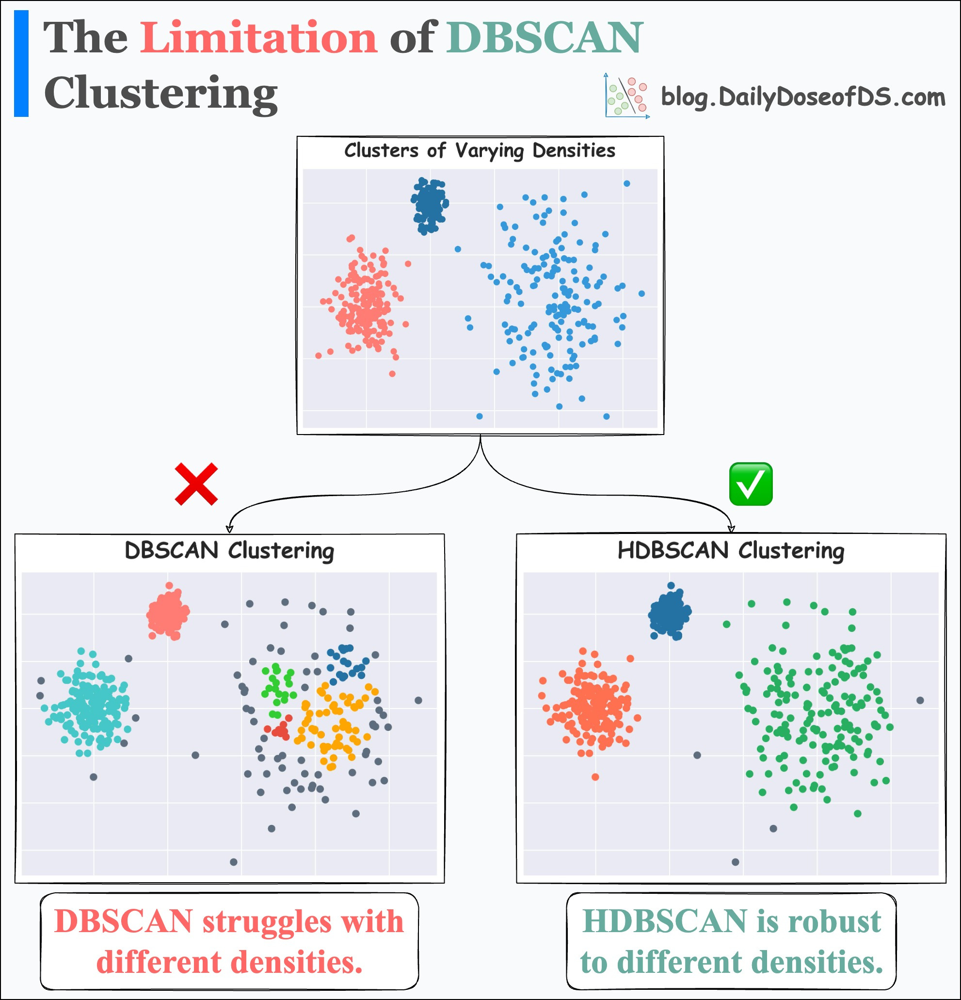

DBSCAN
Two parameters:
neighbors are within distance threshold ϵ away
neighborhood defined consists of t points (or more)

- **CORE:** If Neighbors ≥t
- **BORDER:** If near a CORE point but not CORE itself.
- **NOISE:** If not near any CORE point.

