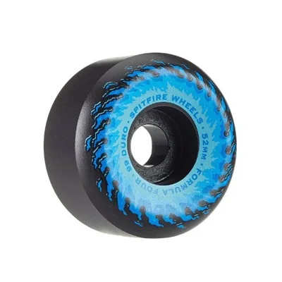
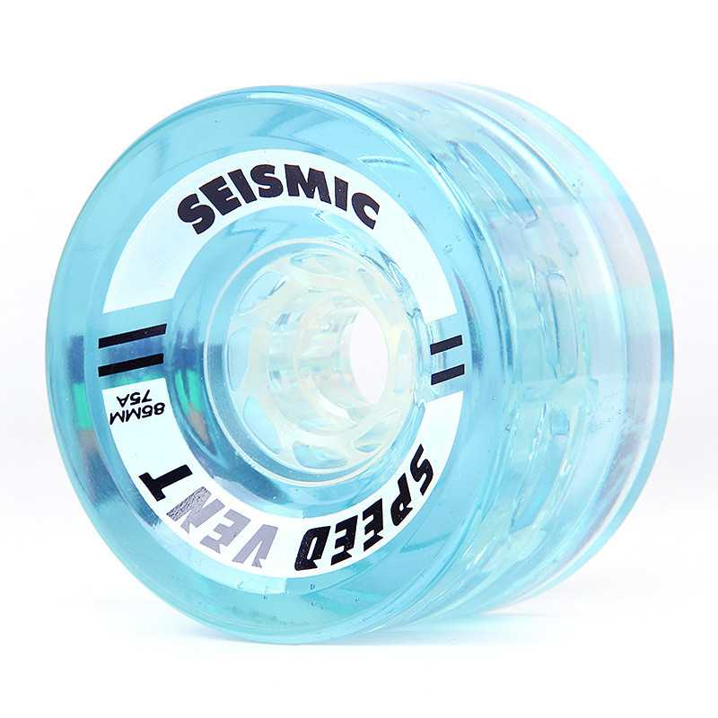
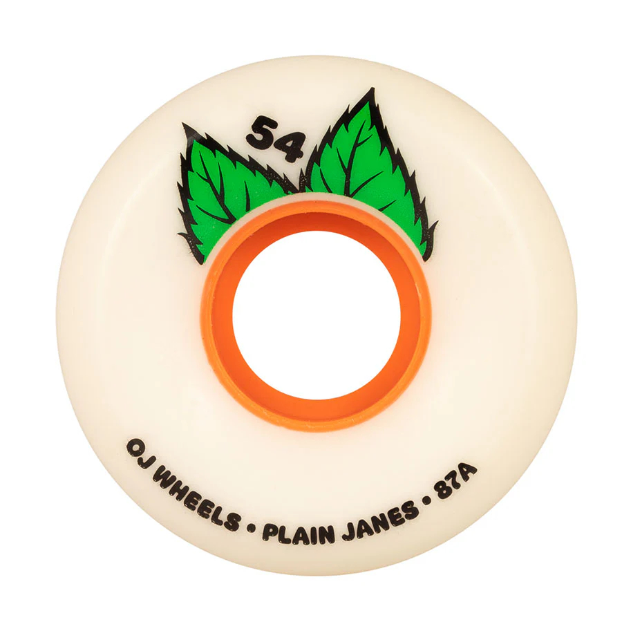

# common setups:
- park skateboard -> 
	- high (98a-101a)
	- low (54mm)
## Powell Peralta Nano Cubics

- cruiser ->
	- soft (78a)
	- low (54-60mm)
		- Keep this on the lower end to avoid wheelbite (and to avoid a high board)
	- wide (contact patch: 40-50mm)
## Landyachtz Fatty Hawgs

- longboard ->
	- soft (under 90a)
	- high (above 70mm)
	- wide (contact patch: above 40mm)
## Orangatang Stimulus

# Wheels Spreadsheet

| Brand          | Name                             | Image                                                         | Size      | patch/width | Durometer | Park Compatibility | Cruiser Compatibility | Longboard Compatibility |
| -------------- | -------------------------------- | ------------------------------------------------------------- | --------- | ----------- | --------- | ------------------ | --------------------- | ----------------------- |
| Powell Peralta | Dragon Formula                   |     | 60mm high | 25/40mm     | 88a       | 4/5                | 3/5                   | 0/5                     |
| Spitfire       | Formula Four Conical OG Fireball |                           | 54mm      | 20.2/32.2mm | 99a       | 5/5                | 0/5                   | 0/5                     |
| Orangatang     | Stimulus                         |     | 70mm high | 42/??mm     | 83a       | 0/5                | 3/5                   | 5/5                     |
| Powell Peralta | Nano Cubics                      |     | 56mm high | 21/37mm     | 97a       | 4/5                | 4/5                   | 0/5                     |
| Seismic        | Speed Vents                      |                    | 85mm high | 50/52mm     | 75a       | 0/5                | 2/5                   | 5/5                     |
| Seismic        | Tantrums                         |     | 68mm high | 31/43mm     | 81a       | 2/5                | 3/5                   | 0/5                     |
| Powell Peralta | Nano Cubics                      |     | 60mm high | 21.5/38mm   | 93a       | 3/5                | 4/5                   | 0/5                     |
| Powell Peralta | G-slides                         |   | 59mm high | 36/44mm     | 85a       | 3/5                | 4/5                   | 0/5                     |
| Landyachtz     | Chubby Hawgs                     |     | 60mm high | 42/45mm     | 78a       | 0/5                | 5/5                   | 0/5                     |
| Landyachtz     | Fatty Hawgs                      |     | 63mm high | 48/54mm     | 78a       | 0/5                | 5/5                   | 0/5                     |
| Landyachtz     | Doozies                          |     | 63mm high | 58/64mm     | 78a       | 0/5                | 4/5                   | 0/5                     |
| Landyachtz     | Plow King GT                     |     | 74mm high | 66.5/66.5mm | 76a       | 0/5                | 4/5                   | 5/5                     |
| OJ Wheels      | Plain Jane                       |  | 54mm high | 22/35mm     | 87a       | 2/5                | ⭐⭐⭐⭐⭐                 | 0/5                     |
|                |                                  |                                                               |           |             |           |                    |                       |                         |
